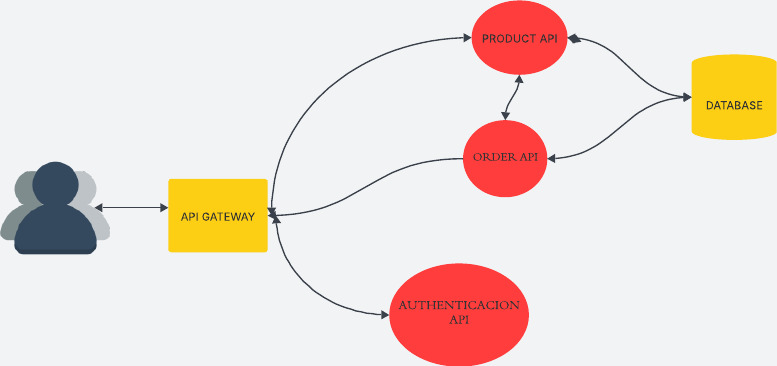

# Ecommerce Backend Project

Este repositorio contiene todas las APIs y servicios para el sistema de Ecommerce.

## APIs:
- [Product API](#)
- [Order API](#)
- [Authentication API](#)
- [Common Libraries](#)

## Descripción del Proyecto

Este proyecto incluye varias APIs que permiten gestionar productos, pedidos y la autenticación de los usuarios para un sistema de Ecommerce.

### Product API
La API de productos permite realizar operaciones CRUD para gestionar los productos disponibles en el sistema.

### Order API
La API de pedidos permite gestionar la creación y el seguimiento de pedidos, asegurándose de que haya stock disponible para el pedido.

### Authentication API
La API de autenticación maneja el registro de usuarios, el inicio de sesión y la generación de tokens JWT para la autenticación.

## Cómo Ejecutar

Instrucciones para ejecutar cada API y los servicios asociados, incluyendo configuraciones de base de datos y dependencias.

---

*Si necesitas más detalles sobre el proyecto, puedes revisar cada repositorio específico de cada API.*
